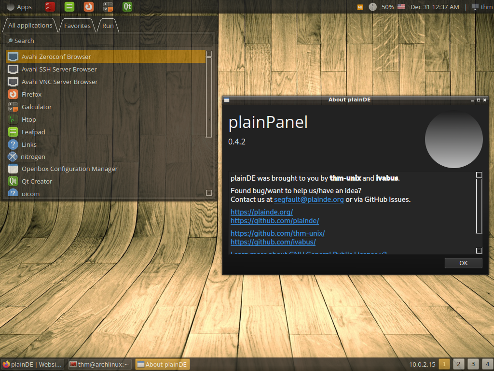
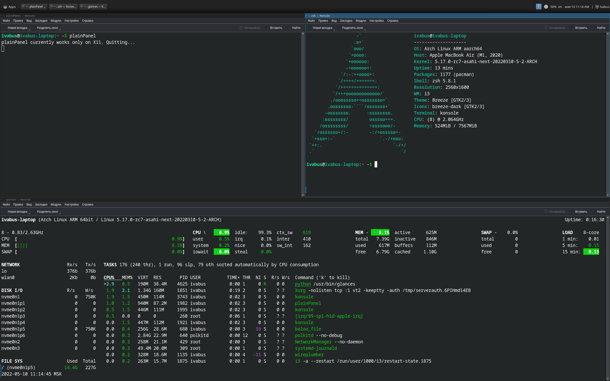

On this page you can see various user screenshots of plainDE (like on r/unixporn).

To submit your own screenshots, make a pull request with addition to main table with screenshots and instructions to reconstruct your setup. Look at existing screenshots, for example.

|---|---|
| Screenshot | Description |
|  | Just a default configuration featuring:   - OpenBox   - Dark theme   - Mint-Y icons   - Transparency   - Multi panel   - Launchers   - MPRIS applet|
|  | plainDE + i3 configuration by ivabus   - i3-gaps (config at i3-ivabus/i3config)   - plainDE (config at i3-ivabus/config.json)   [Reddit post](https://www.reddit.com/r/unixporn/comments/umdv2c/plaindei3_maximum_customisation_by_selfmade_de/)|
