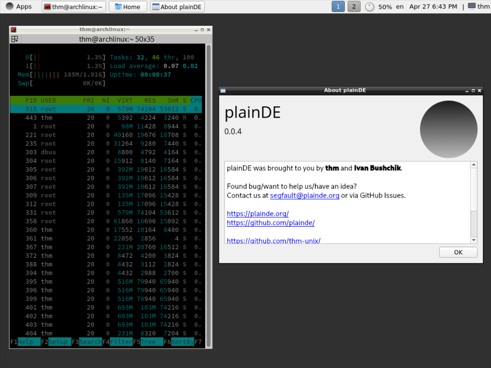

<div align=center>
  
  <br>
  <i>Lightweight. Rapid. Plain.</i>
  <br>
  <a href="https://github.com/plainDE">View On GitHub</a>
</div>

## About project
The aim of this project is to create a lightweight desktop environment for GNU/Linux. Currently we use C++/Qt for developing plainDE, but we will consider integrating other languages if required.

## Screenshots


## Install
Install dependencies: qt6-base noto-fonts-emoji polkit ttf-opensans make alsa-utils kwindowsystem

  
```sh
git clone https://github.com/plainDE/plainInstaller
cd plainInstaller
chmod +x installer.sh
./installer.sh
```
  
Now you can add plainPanel to your OpenBox/FluxBox/... autostart and enjoy!
```
plainPanel
```

**Note**. Use setxkbmap to change your keyboard layout.


## Customizing
There is currently no control center app, but you can edit ~/.config/plainDE/config.json.<br><br>
**Attention**. We can't use Adwaita icons as default anymore since GNOME 42 release (Adwaita does not follow the freedesktop.org specifications). Please use Mint-Y or other icon pack.


## Bugs/ideas/contributing
Found a bug or would like to contribute to the project?<br>
See <a href="https://plainde.org/pages/get-involved">Get Involved</a> page.

## Our social media
- Telegram: <a href="https://t.me/plainDENews">In English</a>, <a href="https://t.me/plainDENewsRUS">На Русском</a>
- Twitter: <a href="https://twitter.com/plain_DE">@plain_DE</a>
- Matrix chat: <a href="https://matrix.to/#/#plainde:matrix.org">#plainde:matrix.org</a>
- VK: <a href="https://vk.com/plainDE">plainDE</a>
