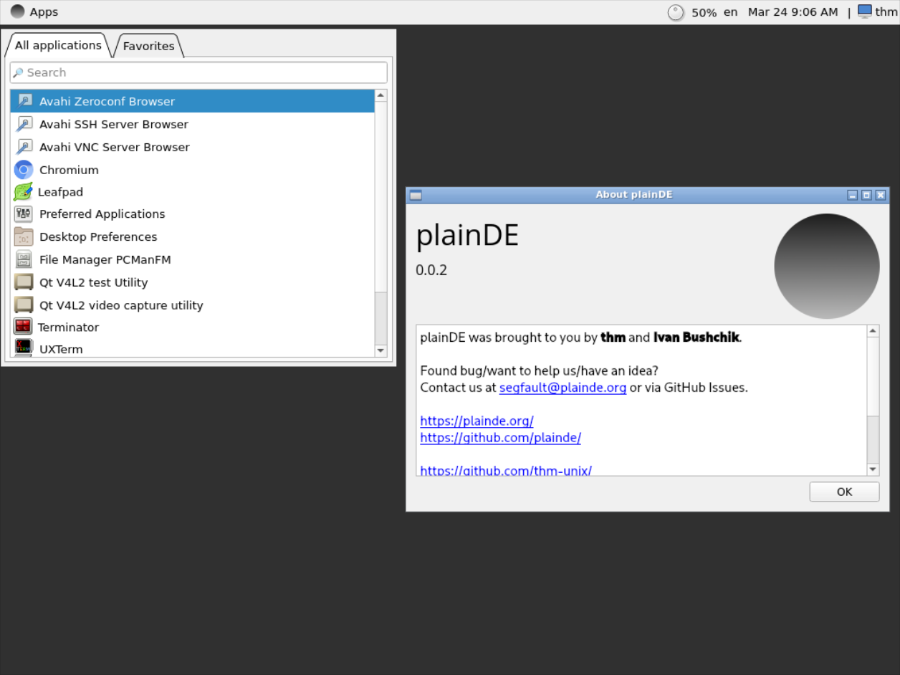

<div align=center>
  
  <br>
  <i>Lightweight. Rapid. Plain.</i>
  <br>
  <ul><li class="fork"><a href="{{ site.github.repository_url }}">View On GitHub</a></li></ul>
</div>

# About project
The aim of this project is to create a lightweight desktop environment for GNU/Linux. Currently we use C++/Qt for developing plainDE, but we will consider integrating other languages if required.

# Screenshots


# Install

Install dependencies: qt6-base noto-fonts-emoji polkit ttf-opensans adwaita-icon-theme make alsa-utils

  
```
git clone https://github.com/plainDE/plainInstaller
cd plainInstaller; chmod +x install.sh
./install.sh
```
  
Now you can add plainPanel to your OpenBox/FluxBox/... autostart and enjoy!
```
plainPanel
```

**Note** Use setxkbmap to change your keyboard layout.


# Bugs/ideas/contributing
Found a bug or would like to contribute to the project?<br>
Contact us at <a href="mailto:segfault@plainde.org">segfault@plainde.org</a> or via GitHub Issues.
