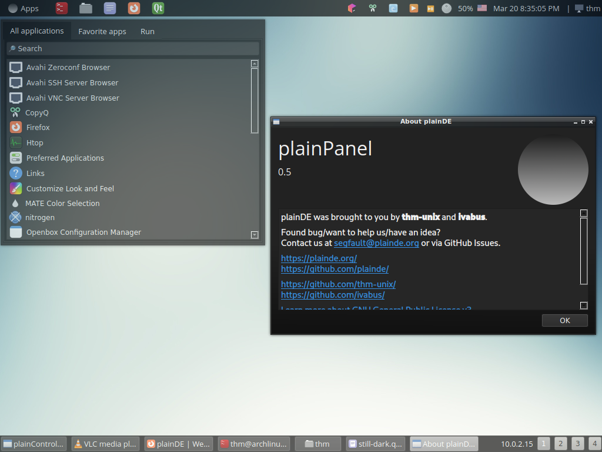

<a href="/pages/version-history">View plainDE version history...</a> 
<a href="https://github.com/plainDE/plainPanel">View source code...</a>

## About project

The aim of this project is to create a lightweight desktop environment for GNU/Linux. Currently we use C++/Qt and Python for developing plainDE, but we will consider integrating other languages if required.

## Customizing

Now control center app (v0.1 and upper)!

### Samples of desktops
Screenshots of some customizations can be found on [Gallery](/gallery) page.

## Miscellaneous

**Note**. We can't use Adwaita icons as default anymore since GNOME 42 release (Adwaita does not follow the freedesktop.org specifications). We recommend using Mint-Y icon pack.

## Bugs/ideas/contributing

Found a bug or would like to contribute to the project?

See <a href="https://plainde.github.io/pages/get-involved">Get Involved</a> page.

## Our social media

- Telegram: <a href="https://t.me/plainDENews">In English</a>, <a href="https://t.me/plainDENewsRU">На русском</a>
- Mastodon: <a rel="me" href="https://social.treehouse.systems/@plainDE">@plainDE@treehouse.systems</a>
- Matrix chat: <a href="https://matrix.to/#/#plainde:matrix.org">#plainde:matrix.org</a>
