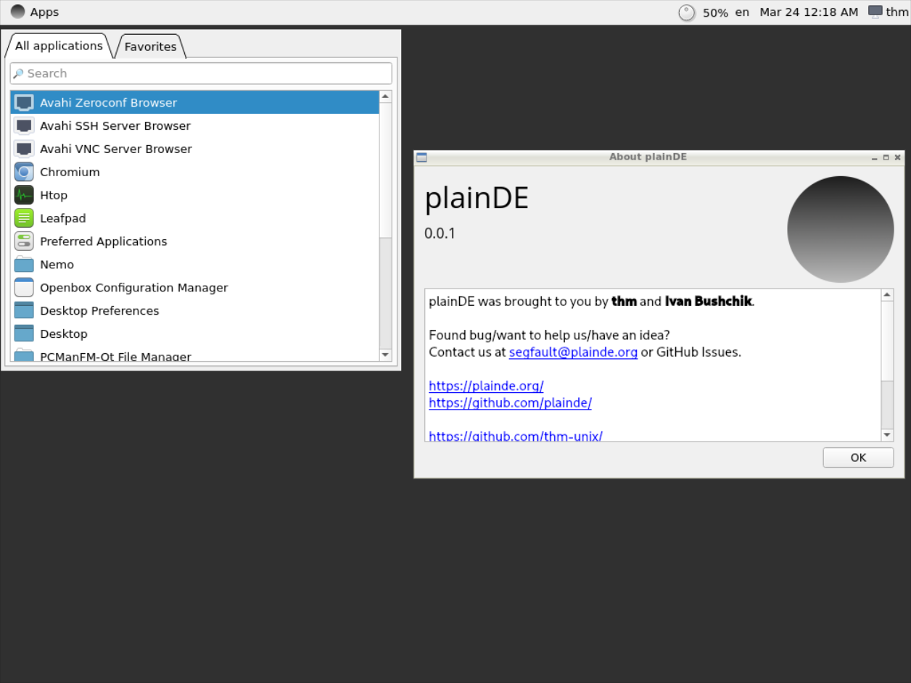

# plainDE

  
  
Lightweight. Rapid. Plain.

# About project
The aim of this project is to create a lightweight desktop environment for GNU/Linux. Currently we use C++/Qt for developing plainDE, but we will consider integrating other languages if required.

# Screenshots

# Install
<ol>
  <li>Install dependencies: <i>qt6-base, noto-fonts-emoji, polkit, ttf-opensans, make</i></li>
  <li><pre class="hljs" style="display: block; overflow-x: auto; padding: 0.5em; background: rgb(240, 240, 240) none repeat scroll 0% 0%; color: rgb(68, 68, 68);">git clone https://github.com/plainDE/plainInstaller</pre></li>
  <li><pre class="hljs" style="display: block; overflow-x: auto; padding: 0.5em; background: rgb(240, 240, 240) none repeat scroll 0% 0%; color: rgb(68, 68, 68);">cd plainInstaller; chmod +x install.sh</pre></li>
  <li><pre class="hljs" style="display: block; overflow-x: auto; padding: 0.5em; background: rgb(240, 240, 240) none repeat scroll 0% 0%; color: rgb(68, 68, 68);">sudo ./install.sh</pre></li>
</ol>

# Bugs/ideas/contributing
Found a bug or would like to contribute to the project? 
Contact us at <a href="mailto:segfault@plainde.org">segfault@plainde.org</a> or via GitHub Issues.
