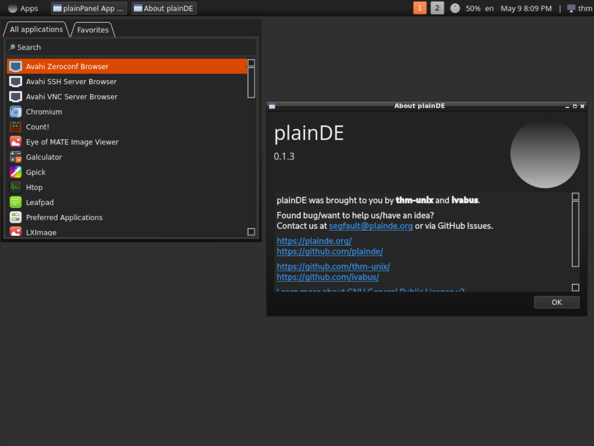
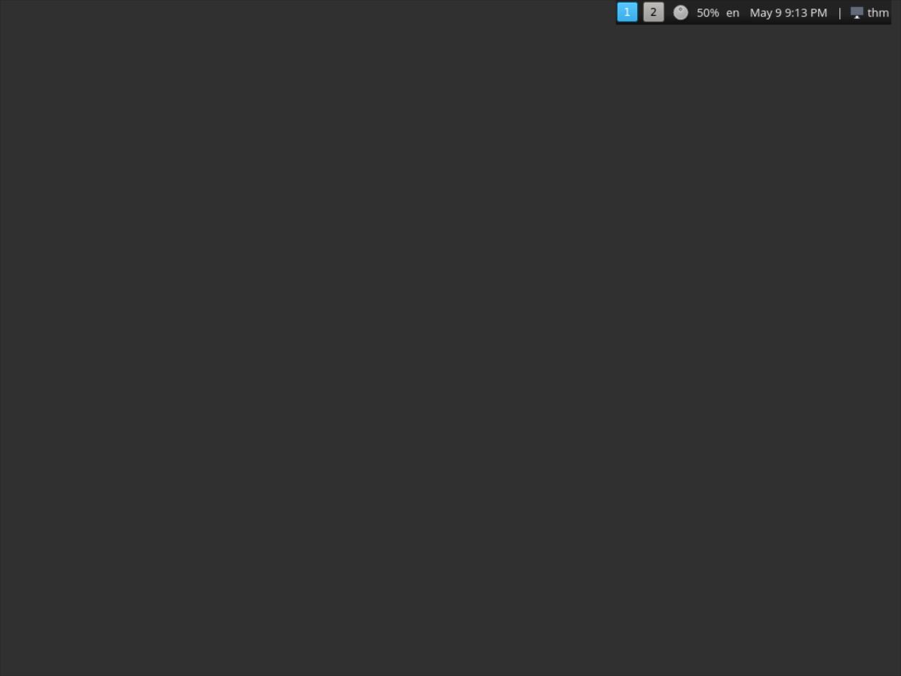

## About project

The aim of this project is to create a lightweight desktop environment for GNU/Linux. Currently we use C++/Qt and Python for developing plainDE, but we will consider integrating other languages if required.

  
  
  

## Screenshots

## Customizing

Now control center app (v0.1 and upper)!

### Samples of desktops

More screenshots could be found on [Gallery](/gallery) page.

## Miscellaneous

**Note**. We can't use Adwaita icons as default anymore since GNOME 42 release (Adwaita does not follow the freedesktop.org specifications). We recommend using Mint-Y icon pack.

**Note**. Use setxkbmap to change keyboard layout.

## Bugs/ideas/contributing

Found a bug or would like to contribute to the project?

See <a href="https://plainde.org/pages/get-involved">Get Involved</a> page.

## Our social media

- Telegram: <a href="https://t.me/plainDENews">In English</a>, <a href="https://t.me/plainDENewsRUS">На Русском</a>
- Twitter: <a href="https://twitter.com/plain_DE">@plain_DE</a>
- Matrix chat: <a href="https://matrix.to/#/#plainde:matrix.org">#plainde:matrix.org</a>
- VK: <a href="https://vk.com/plainDE">plainDE</a>
