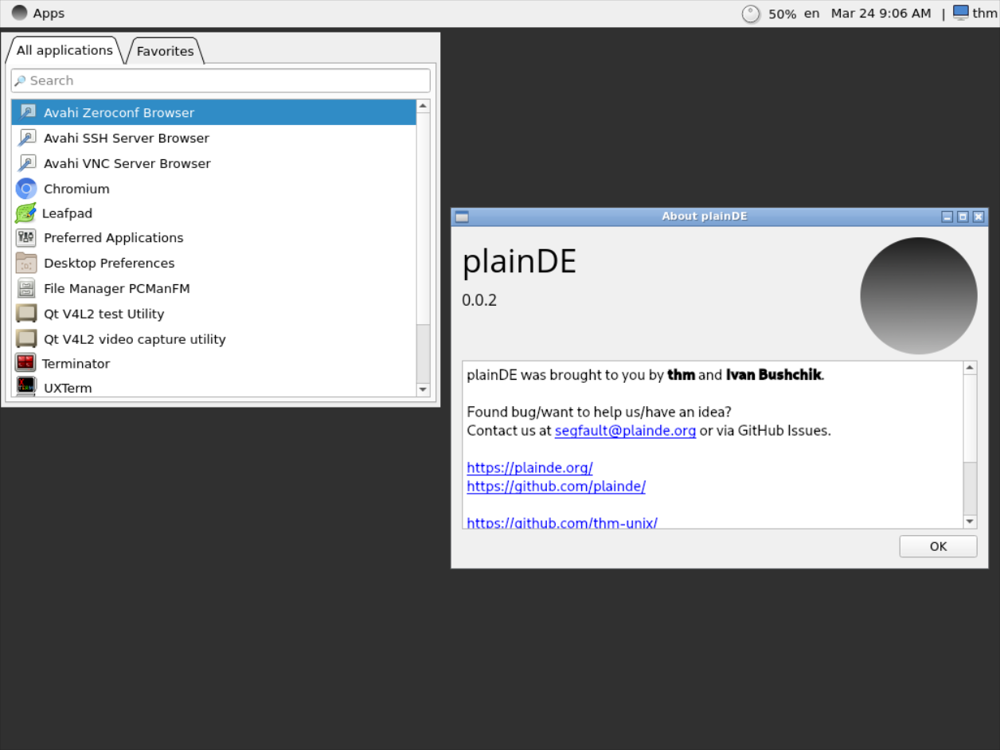

# plainDE version history

<table>
  <tr>
    <td>Version</td>
    <td>Screenshot</td>
    <td>Release Date</td>
  </tr>
  
  <tr>
    <td>0.0.1</td>
    <td></td>
    <td>24.03.2022</td>
  </tr>
  
  <tr>
    <td>0.0.2</td>
    <td></td>
    <td>24.03.2022</td>
  </tr>
  
  <tr>
    <td>0.0.3a</td>
    <td></td>
    <td>25.04.2022</td>
  </tr>
  
  <tr>
    <td>0.0.4</td>
    <td></td>
    <td>27.04.2022</td>
  </tr>
  
  <tr>
    <td>0.1</td>
    <td></td>
    <td>05.05.2022</td>
  </tr>
  
  <tr>
    <td>0.1.1</td>
    <td></td>
    <td>08.05.2022</td>
  </tr>
  
  <tr>
    <td>0.1.2a</td>
    <td></td>
    <td>09.05.2022</td>
  </tr>
  
  <tr>
    <td>0.1.3</td>
    <td></td>
    <td>09.05.2022</td>
  </tr>
  
  <tr>
    <td>0.1.4</td>
    <td></td>
    <td>04.06.2022</td>
  </tr>
  
  <tr>
    <td>0.2</td>
    <td></td>
    <td>20.06.2022</td>
  </tr>
  
  <tr>
    <td>0.2.1</td>
    <td></td>
    <td>13.08.2022</td>
  </tr>
</table>
