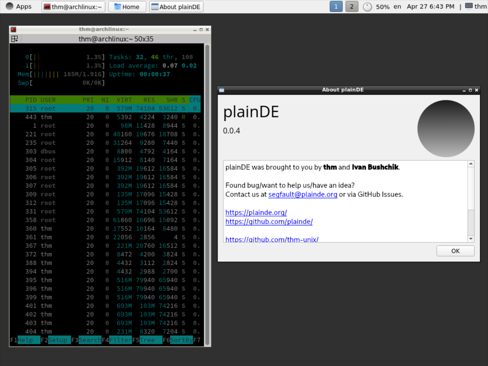
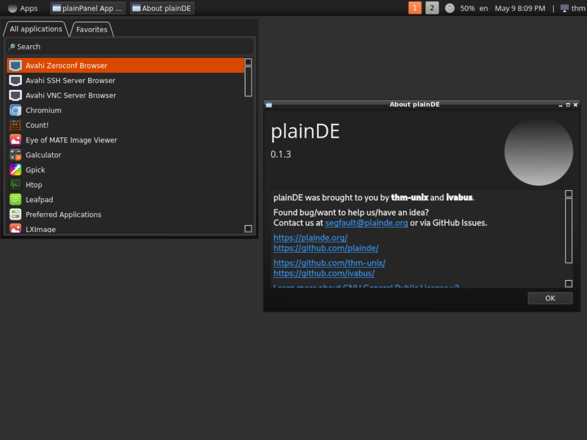
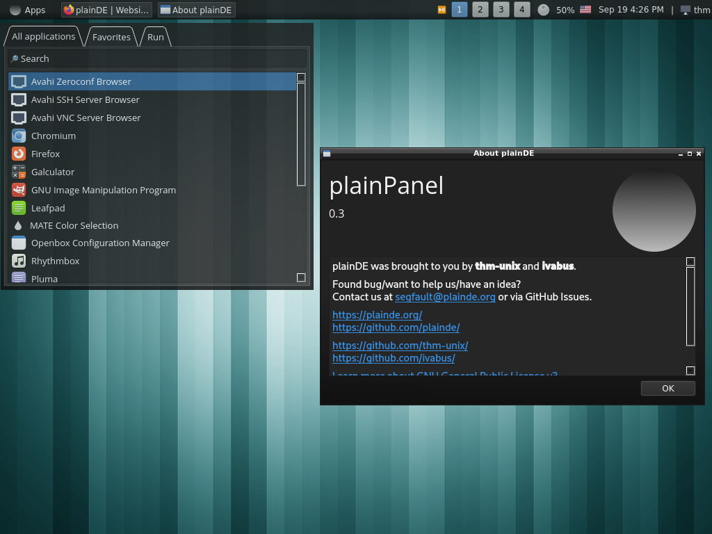
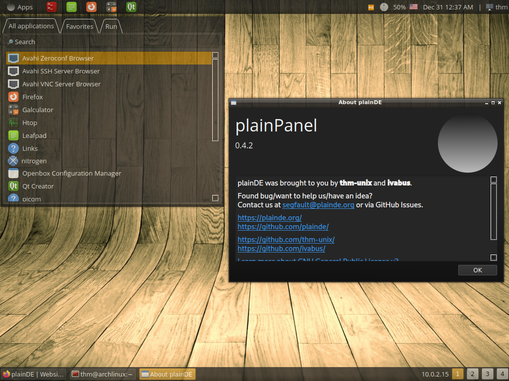
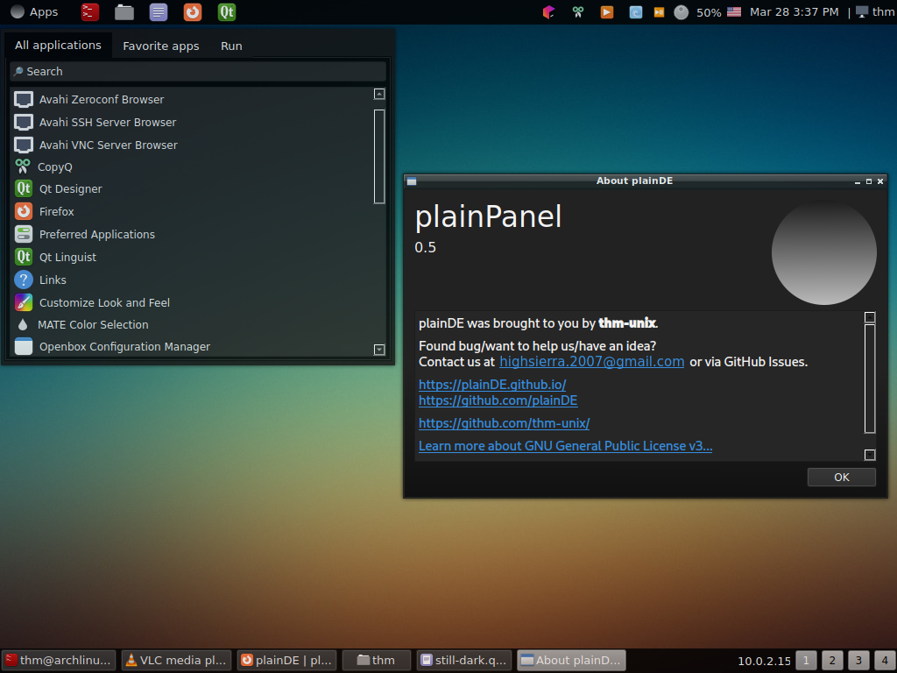

# plainDE version history

<table>
  <tr>
    <td>Version</td>
    <td>Screenshot</td>
    <td>Release Date</td>
  </tr>
  
  <tr>
    <td><a href="https://github.com/plainDE/plainPanel/releases/tag/v.0.0.1">0.0.1</a></td>
    <td></td>
    <td>24.03.2022</td>
  </tr>
  
  <tr>
    <td><a href="https://github.com/plainDE/plainPanel/releases/tag/v.0.0.2">0.0.2</a></td>
    <td></td>
    <td>24.03.2022</td>
  </tr>
  
  <tr>
    <td><a href="https://github.com/plainDE/plainPanel/releases/tag/v.0.0.3a">0.0.3a</a></td>
    <td></td>
    <td>25.04.2022</td>
  </tr>
  
  <tr>
    <td><a href="https://github.com/plainDE/plainPanel/releases/tag/v0.0.4">0.0.4</a></td>
    <td></td>
    <td>27.04.2022</td>
  </tr>
  
  <tr>
    <td><a href="https://github.com/plainDE/plainPanel/releases/tag/v0.1">0.1</a></td>
    <td></td>
    <td>05.05.2022</td>
  </tr>
  
  <tr>
    <td><a href="https://github.com/plainDE/plainPanel/releases/tag/v0.1.1">0.1.1</a></td>
    <td></td>
    <td>08.05.2022</td>
  </tr>
  
  <tr>
    <td><a href="https://github.com/plainDE/plainPanel/releases/tag/v0.1.2a">0.1.2a</a></td>
    <td></td>
    <td>09.05.2022</td>
  </tr>
  
  <tr>
    <td><a href="https://github.com/plainDE/plainPanel/releases/tag/0.1.3">0.1.3</a></td>
    <td></td>
    <td>09.05.2022</td>
  </tr>
  
  <tr>
    <td><a href="https://github.com/plainDE/plainPanel/releases/tag/0.1.4">0.1.4</a></td>
    <td></td>
    <td>04.06.2022</td>
  </tr>
  
  <tr>
    <td><a href="https://github.com/plainDE/plainPanel/releases/tag/0.2">0.2</a></td>
    <td></td>
    <td>20.06.2022</td>
  </tr>
  
  <tr>
    <td><a href="https://github.com/plainDE/plainPanel/releases/tag/0.2.1">0.2.1</a></td>
    <td></td>
    <td>13.08.2022</td>
  </tr>
  
  <tr>
    <td><a href="https://github.com/plainDE/plainPanel/releases/tag/0.3">0.3</a></td>
    <td></td>
    <td>19.09.2022</td>
  </tr>
  
  <tr>
    <td><a href="https://github.com/plainDE/plainPanel/releases/tag/0.4">0.4</a></td>
    <td></td>
    <td>04.11.2022</td>
  </tr>
  
  <tr>
    <td><a href="https://github.com/plainDE/plainPanel/releases/tag/0.4.1">0.4.1</a></td>
    <td></td>
    <td>17.11.2022</td>
  </tr>

  <tr>
    <td><a href="https://github.com/plainDE/plainPanel/releases/tag/0.4.2">0.4.2</a></td>
    <td></td>
    <td>31.12.2022</td>
  </tr>
  
  <tr>
    <td><a href="https://github.com/plainDE/plainPanel/releases/tag/0.5">0.5</a></td>
    <td></td>
    <td>20.03.2023</td>
  </tr>
  
  <tr>
    <td><a href="https://github.com/plainDE/plainPanel/releases/tag/0.5.1">0.5.1</a></td>
    <td></td>
    <td>30.04.2023</td>
  </tr>
  
  <tr>
    <td><a href="https://github.com/plainDE/plainPanel/releases/tag/0.5.2">0.5.2</a></td>
    <td></td>
    <td>25.05.2023</td>
  </tr>

  <tr>
    <td><a href="https://github.com/plainDE/plainPanel/releases/tag/0.6">0.6</a></td>
    <td></td>
    <td>30.06.2023</td>
  </tr>
</table>
